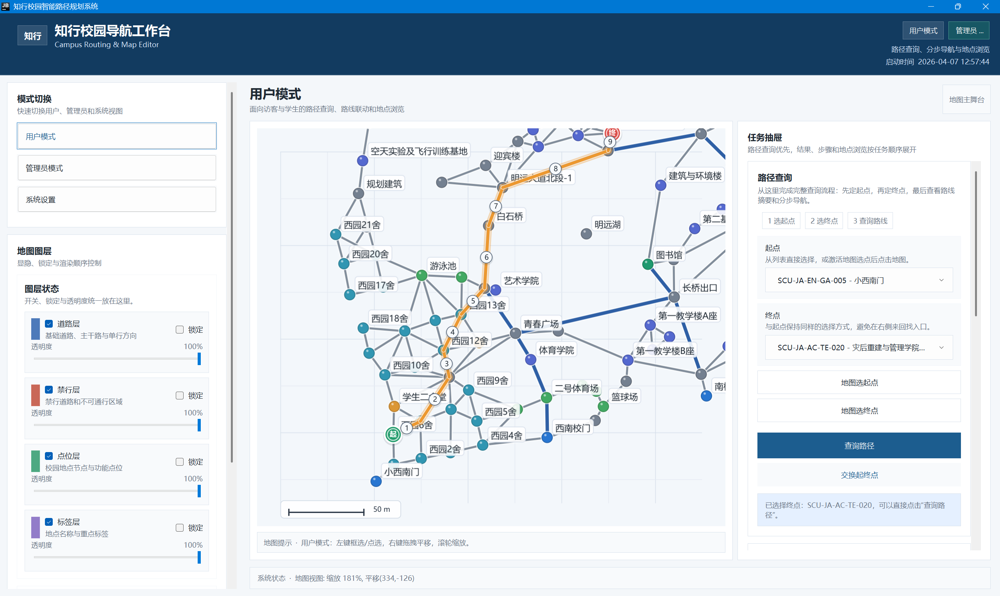

# 校园智能路径规划导航系统



基于 Java 开发的校园导航与地图管理项目，使用图数据结构抽象校园路网，以 Dijkstra 最短路径算法为核心，提供路径查询、分步导航、地图数据管理、权限控制和本地持久化能力。

当前仓库基线已经不止于控制台版本，还包含一套基于 Swing 的地图化工作台：
- 用户可在 GUI 中完成路径查询、地点浏览、地图选点与路径高亮查看
- 管理员可在地图上进行点位/道路编辑、禁行管理、撤销重做、备份恢复
- 系统支持数据自动加载、损坏兜底恢复和本地文件持久化

## 项目目标

这个项目面向“Java 面向对象课程设计 / 大作业”场景，重点体现以下能力：
- 面向对象建模：`Vertex`、`Edge`、`CampusGraph`、`User`、`PathResult`
- 算法工程化落地：基于 `PathPlanningStrategy` 抽象路径规划能力，当前默认实现为 `DijkstraStrategy`
- 工程化交付：控制台版 + Swing GUI 版 + 地图工作台 + 测试脚本 + 文档体系
- 业务完整性：覆盖普通用户导航流程与管理员地图维护流程

## 当前能力

### 用户侧
- 起点/终点路径查询
- 不可达路径提示
- 禁行路段绕行
- 路径详情展示：总距离、预计耗时、途经点、分段距离
- 文字分步导航
- 地点列表浏览与按类型筛选
- GUI 地图选点、路径高亮、步骤联动

### 管理员侧
- 地点新增、修改、删除
- 道路新增、修改、删除
- 禁行设置与解除
- 管理员登录与权限校验
- 数据自动保存
- 数据备份与恢复
- GUI 地图编辑工具、批量操作、撤销/重做

### 系统能力
- `data/` 目录 JSON 持久化
- 文件缺失/损坏时自动回退默认数据
- 密码哈希存储
- 控制台主流程与 GUI 主流程并存
- 集成质量检查脚本

## 技术栈

- 语言：Java
- GUI：Swing / Graphics2D
- 构建：Maven + PowerShell 脚本
- 测试：JUnit 5 + `QualityCheckRunner`
- 数据存储：本地 JSON 文件

说明：
- `pom.xml` 当前配置为 Java 8 语法级别
- 开发环境文档推荐使用 JDK 21 运行，兼容当前代码基线

## 快速开始

### 运行环境
- JDK 21（推荐）
- Windows / macOS / Linux
- Windows 下可直接使用仓库自带 PowerShell 脚本

### 1. 构建项目

```powershell
.\scripts\build.ps1
```

构建产物会输出到 `out/` 目录。

### 2. 启动控制台版

```powershell
.\scripts\run.ps1
```

控制台启动入口：
- `com.zhixing.navigation.app.Main`

### 3. 启动 GUI 版

```powershell
.\scripts\run-gui.ps1
```

GUI 启动入口：
- `com.zhixing.navigation.app.AppLauncher`

### 4. 执行质量检查

```powershell
.\scripts\qa.ps1
```

质量检查入口：
- `com.zhixing.navigation.app.QualityCheckRunner`

### 5. 使用 Maven

如果你本机安装了 Maven，也可以直接使用：

```powershell
mvn test
```

在 IDE 中推荐直接运行以下主类：
- 控制台版：`com.zhixing.navigation.app.Main`
- GUI 版：`com.zhixing.navigation.app.AppLauncher`

## 数据目录与默认数据

项目默认使用仓库根目录下的 `data/` 作为数据目录，主要文件包括：
- `data/vertex.json`：地点数据
- `data/edge.json`：道路数据
- `data/user.json`：用户数据
- `data/backup/`：备份目录

系统支持通过环境变量切换数据目录：

```powershell
$env:ZHIXING_DATA_DIR = "D:\\temp\\zhixing-data"
.\scripts\run-gui.ps1
```

当数据文件缺失或损坏时，系统会自动加载默认数据并重写文件。

默认回退数据中预置账号：
- 管理员：`admin / admin123`
- 普通用户：`guest / guest123`

## 项目结构

```text
ZhiXing/
├─ data/                     # 默认数据与备份
├─ docs/                     # PRD、设计、测试、开发文档
├─ scripts/                  # 构建、运行、回归脚本
├─ src/main/java/com/zhixing/navigation
│  ├─ app/                   # 启动入口、控制台流程、质量检查
│  ├─ application/           # 应用服务层（导航 / 认证 / 地图）
│  ├─ domain/                # 领域模型、图结构、算法抽象、权限模型
│  ├─ gui/                   # Swing 界面、控制器、视图、样式
│  └─ infrastructure/        # 持久化与默认数据
└─ src/test/java/            # 单元测试
```

## 架构说明

项目采用分层设计：
- 表现层：控制台菜单与 Swing GUI
- 应用层：`NavigationService`、`MapService`、`AuthService`
- 领域层：图模型、路径结果、用户与权限、路径规划策略
- 基础设施层：`PersistenceService`、默认数据工厂、简易 JSON 读写

关键设计点：
- 图模型：地点是顶点，通行道路是带权边
- 策略模式：路径规划基于 `PathPlanningStrategy` 抽象
- 权限隔离：普通用户与管理员职责分离
- 命令模式：地图工作台中的撤销/重做通过命令栈实现

## 文档导航

以下文档是这份 README 的主要依据：

- [PRD](docs/PRD.md)：产品目标、功能需求、验收标准
- [后续执行清单](docs/后续执行清单.md)：M1-M5 推进情况与当前基线
- [地图化工作台重构任务安排表](docs/地图化工作台重构任务安排表.md)：M6 地图工作台设计、任务拆分与验收标准
- [开发环境配置](docs/开发环境配置.md)：环境与首次运行说明
- [数据持久化说明](docs/数据持久化说明.md)：数据文件结构与持久化能力
- [测试报告](docs/测试报告.md)：测试范围、方式与结论
- [课程设计报告](docs/课程设计报告.md)：项目背景、架构、UML 与任务安排

## 测试与质量保障

仓库当前同时包含两类质量保障手段：
- JUnit 单元测试：覆盖认证、地图服务、持久化、控制器等核心模块
- 集成质量检查：通过 `QualityCheckRunner` 覆盖用户主流程、管理员主流程、异常场景和性能基线

质量检查重点覆盖：
- 路径查询与地点浏览
- 管理员地图维护
- 非法输入与权限越界
- 文件损坏/缺失兜底
- 启动与查询性能

## 当前迭代状态

结合文档与现有代码，当前仓库可以理解为：
- 已完成控制台核心版本交付
- 已完成 Swing GUI 版本功能映射
- 已完成地图化工作台重构主线
- 仍可继续补强文档收口、答辩材料、进一步交互优化

如果你接手这个项目，建议优先阅读顺序为：
1. [PRD](docs/PRD.md)
2. [课程设计报告](docs/课程设计报告.md)
3. [后续执行清单](docs/后续执行清单.md)
4. [地图化工作台重构任务安排表](docs/地图化工作台重构任务安排表.md)
5. 代码入口：`AppLauncher` / `Main`

## 许可证

当前仓库未单独声明开源许可证；如需对外发布，建议补充许可证文件并明确使用范围。
