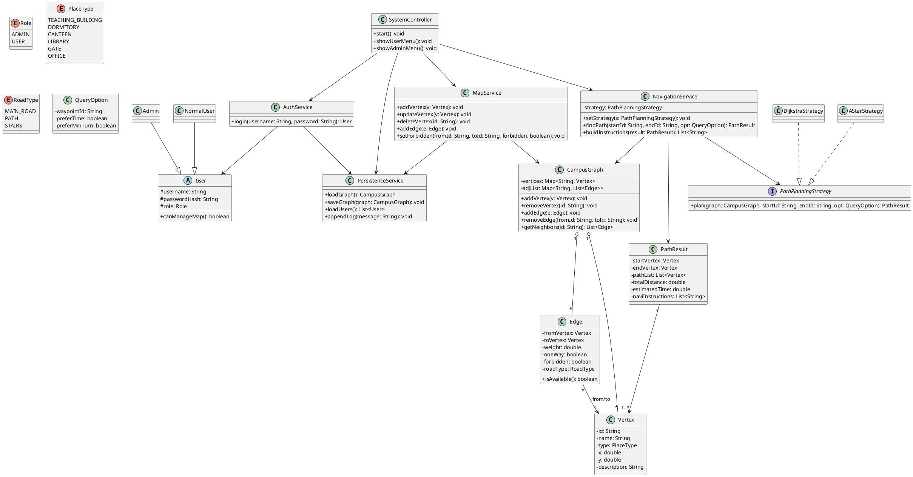

# 校园智能路径规划导航系统课程设计报告

## 1. 项目概述

### 1.1 项目背景
校园内部道路复杂、建筑密集，通用地图软件在校园小路、临时封路和楼宇级导航方面覆盖不足，导致新生、访客和师生在校内寻路效率低。  
本项目基于 Java 面向对象思想，以图结构建模校园路网，结合最短路径算法实现校内导航，满足课程设计中“数据结构 + 算法 + 工程化设计”的综合要求。

### 1.2 项目目标
1. 构建可维护、可扩展的校园导航系统，实现地点与道路数据管理。  
2. 实现基于 Dijkstra 的最短路径计算，支持禁行绕行与不可达提示。  
3. 输出可读性强的分步导航指引，满足控制台版本课程交付要求。  
4. 通过接口化设计为 A*、GUI 可视化等后续扩展预留能力。

### 1.3 适用对象
1. 普通用户：在校学生、教职工、校外访客。  
2. 管理员：校园后勤或系统维护人员。

## 2. 需求分析

### 2.1 功能需求

#### 2.1.1 P0
1. 地图数据管理：地点/道路增删改查、持久化存储与启动加载。  
2. 路径规划：最短路径计算、路径可达性校验、禁行过滤。  
3. 导航输出：路径详情（总距离、分段距离、途经点）与文字分步导航。  
4. 系统交互：角色权限控制、控制台菜单交互、输入容错处理。

#### 2.1.2 P1
1. 禁行路段管理（时段封禁与恢复）。  
2. 多路径推荐（最短距离/最短耗时/最少转弯）。  
3. 算法切换（Dijkstra 与 A* 策略切换）。  
4. 管理员登录与地点分类筛选。

#### 2.1.3 P2
1. 路径收藏、操作日志记录。  
2. GUI 可视化地图、路径高亮、缩放拖拽、语音播报。

### 2.2 非功能需求
1. 性能：顶点 <= 200、边 <= 500 时单次路径计算 <= 1s，启动加载 <= 2s。  
2. 可靠性：异常输入、文件异常、不可达路径均需友好提示，不崩溃。  
3. 兼容性：JDK 8+，支持 Windows/macOS/Linux。  
4. 可扩展性：算法、地图数据、功能模块均可低耦合扩展。  
5. 易用性：3 步内完成核心路径查询，菜单清晰、提示明确。

## 3. UML 类图

## 4. 系统架构设计

### 4.1 分层架构
1. 表现层（Presentation）  
控制台菜单（V1.0）或 GUI 界面（V1.2），负责输入采集、结果展示、异常提示。

2. 应用服务层（Application Service）  
`SystemController` 负责流程编排；`MapService` 负责地图维护；`NavigationService` 负责路径规划；`AuthService` 负责登录鉴权。

3. 领域层（Domain）  
核心对象包括 `CampusGraph`、`Vertex`、`Edge`、`PathResult`、`User`，封装业务规则与数据结构。

4. 基础设施层（Infrastructure）  
`PersistenceService` 负责 JSON/TXT 文件读写、日志记录、系统启动加载与数据落盘。

### 4.2 架构关键点
1. 策略模式：路径算法通过 `PathPlanningStrategy` 抽象，上层只依赖接口。  
2. 低耦合：地图管理、导航计算、权限认证、数据持久化职责分离。  
3. 可扩展：新增算法或 GUI 展示时，不破坏既有控制台核心功能。  
4. 可维护：领域对象稳定，业务逻辑集中在服务层，便于测试与迭代。

### 4.3 运行流程（简述）
1. 系统启动后通过 `PersistenceService` 加载地点、道路、用户数据。  
2. 用户进入菜单发起查询，`NavigationService` 调用策略算法计算路径。  
3. 返回 `PathResult` 并生成分步导航。  
4. 管理员修改地图后，`MapService` 触发持久化并记录日志。
